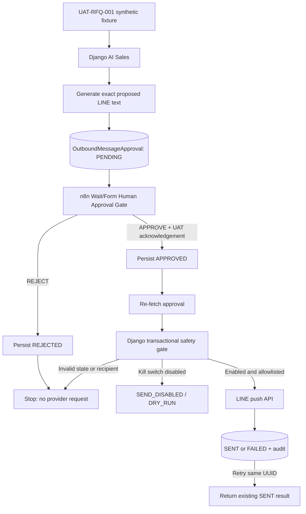

# N8N + LINE UAT DEMO — BÁO CÁO TỔNG HỢP VÀ BÀN GIAO

**Ngày lập báo cáo:** 2026-09-26
**Repository:** `https://github.com/hoangquocquan/Django-web-t-123.git`
**Worktree triển khai:** `C:\Users\hoang\Documents\Codex\n8n-line-uat-demo`
**Nhánh:** `feature/n8n-line-uat-demo`
**Base commit:** `6c349268db269108f9a012656c5fef37a5b7ab85`
**Implementation commit:** `25d2f2a7a67a4fac2c76599913d6c52c7bfab350`
**Trạng thái:** Đã triển khai và kiểm thử; chưa merge, chưa push; chờ human review.

> **THIS WORKFLOW IS UAT ONLY. DO NOT CONNECT REAL CUSTOMER DATA. DO NOT ENABLE PRODUCTION SENDING.**

## 1. Tóm tắt kết quả

Đã xây dựng hoàn chỉnh demo tích hợp n8n + Django AI Sales + LINE Messaging API dành riêng cho UAT. Luồng tạo nội dung LINE từ một RFQ tổng hợp, lưu nội dung ở trạng thái `PENDING`, yêu cầu Manager/Admin quyết định rõ ràng `APPROVE` hoặc `REJECT`, sau đó mới cho phép tiến tới cổng gửi.

Các nguyên tắc an toàn chính đã được triển khai:

- AI Sales chỉ tư vấn; `autonomous_action` luôn là `false`.
- Không có dữ liệu khách hàng thật trong fixture hoặc source code.
- Không có LINE token, channel secret hoặc user ID thật trong Git.
- `LINE_SEND_ENABLED` mặc định là `false`.
- Không có đường gửi tự động, timeout-to-approve hoặc implicit approval.
- Django là ranh giới gửi duy nhất và kiểm tra lại toàn bộ điều kiện an toàn phía server.
- Chỉ một LINE UAT recipient được allowlist; không hỗ trợ broadcast, multicast hoặc narrowcast.
- Approval UUID được dùng làm business/idempotency key và LINE retry key để ngăn gửi lặp.
- Kết quả gửi và toàn bộ chuyển trạng thái được lưu vào audit record.

## 2. Phạm vi thực hiện

Phần triển khai chỉ nằm trong kiến trúc hiện hành dưới `django_backend/`. Không khôi phục, import hoặc sử dụng `backend/` legacy.

Phạm vi bao gồm:

1. Fixture khách hàng và RFQ tổng hợp, xác định rõ `environment=uat` và `synthetic=true`.
2. Model `OutboundMessageApproval` cùng migration.
3. Permission riêng cho đọc và phê duyệt LINE UAT.
4. Service tạo draft, approve, reject, gửi và audit.
5. Internal API phục vụ n8n.
6. Workflow n8n có Wait/Form human approval gate.
7. Backend kill switch và recipient allowlist.
8. LINE push adapter một người nhận.
9. At-most-once claim, content fingerprint và LINE retry key để chống gửi lặp.
10. Bộ test an toàn và regression.
11. Tài liệu cấu hình, chạy demo, rollback và giới hạn.

## 3. Kiến trúc đã triển khai



### Lý do LINE call được đặt sau Django boundary

n8n điều phối workflow nhưng không giữ LINE channel access token. Sau khi human approval hoàn tất, n8n gọi endpoint gửi của Django. Django khóa bản ghi approval và kiểm tra lại trạng thái, environment, synthetic marker, channel, allowlist, kill switch và idempotency trước khi gọi LINE.

Thiết kế này ngăn việc chỉnh sửa workflow n8n để bỏ qua các kiểm tra an toàn. Token LINE chỉ tồn tại ở runtime configuration của Django và không xuất hiện trong workflow export hoặc execution output.

## 4. Luồng trạng thái

| Trạng thái hiện tại | Hành động hợp lệ | Trạng thái/kết quả tiếp theo | Có thể gọi LINE |
|---|---|---|---|
| Mới tạo | Create draft | `PENDING` | Không |
| `PENDING` | Approve | `APPROVED` | Chưa |
| `PENDING` | Reject | `REJECTED` | Không |
| `APPROVED` | Send, kill switch off | `APPROVED` + `SEND_DISABLED` | Không |
| `APPROVED` | Send, hợp lệ | `SENT` | Tối đa một provider attempt tự động |
| `APPROVED` | Provider lỗi | `FAILED` | Đã thử một lần |
| `REJECTED` | Send | Bị từ chối | Không |
| `PENDING` | Send | Bị từ chối | Không |
| `SENT` | Retry | Trả kết quả `SENT` hiện hữu | Không gọi lại |
| `FAILED` | Retry | Bị từ chối; cần draft mới | Không |

Không có transition tự động từ `PENDING` sang `APPROVED`. Không có timeout nào được coi là approval.

## 5. Dữ liệu UAT

Fixture nằm tại:

`django_backend/apps/ai_agent/fixtures/line_uat_demo.json`

Nội dung chính:

| Thuộc tính | Giá trị |
|---|---|
| Customer ID | `UAT-CUST-001` |
| Customer name | `UAT Tanaka Manufacturing` |
| LINE user ID | `ENV:LINE_UAT_RECIPIENT_USER_ID` |
| RFQ ID | `UAT-RFQ-001` |
| Part | `SUS304 Precision Bracket` |
| Quantity | `100` |
| Material | `SUS304` |
| Process | `CNC machining` |
| Due date | `2027-12-01` |
| Environment | `uat` |
| Synthetic | `true` |
| Warning | `UAT ONLY - DO NOT CONTACT REAL CUSTOMER` |

API chỉ chấp nhận RFQ tổng hợp đã bundle. Payload non-synthetic, environment khác `uat`, RFQ không xác định hoặc field ngoài contract đều bị từ chối.

## 6. Model và audit

Model `OutboundMessageApproval` sử dụng UUID làm primary key và lưu:

- `environment`, `synthetic`, `rfq_id`, `channel`, `recipient_ref`.
- Exact `proposed_message` được duyệt và gửi.
- Trạng thái `PENDING`, `APPROVED`, `REJECTED`, `SENT`, `FAILED`.
- AI payload và synthetic RFQ snapshot.
- Người approve/reject và timestamp.
- `send_attempted`, `line_result_status`, `sent_at`.
- LINE request ID nếu provider trả về.
- Provider response đã giới hạn, không chứa bearer token.
- Danh sách audit event có actor, action và timestamp.

Database constraints bắt buộc:

- `environment = "uat"`
- `synthetic = true`
- `channel = "line"`

Service-level checks tiếp tục kiểm tra các invariant trên trước mọi provider call.

## 7. Phân quyền

Migration `0011_line_uat_permissions.py` tạo:

- `line_uat:read`
- `line_uat:approve`

Ma trận quyền:

| Role | Create/read draft | Approve/reject/send |
|---|---:|---:|
| Sales | Có | Không |
| Manager | Có | Có |
| Admin | Có | Có |
| Anonymous/Viewer/role khác | Không | Không |

Ngoài role check, request còn phải có quyền `ai_sales:read`, `sales:read` và permission LINE UAT tương ứng.

## 8. Django endpoints đã thêm

| Method | Endpoint | Mục đích |
|---|---|---|
| POST | `/api/v1/internal/line-uat/drafts/` | Chạy AI Sales trên RFQ tổng hợp và tạo `PENDING` |
| GET | `/api/v1/internal/line-uat/approvals/{uuid}/` | Đọc approval và audit an toàn |
| POST | `/api/v1/internal/line-uat/approvals/{uuid}/approve/` | Manager/Admin approve |
| POST | `/api/v1/internal/line-uat/approvals/{uuid}/reject/` | Manager/Admin reject |
| POST | `/api/v1/internal/line-uat/approvals/{uuid}/send/` | Kiểm tra kill switch/allowlist/idempotency và gọi LINE |

Endpoint AI Sales hiện hữu không bị thay đổi contract:

- `POST /api/v1/internal/ai-sales/analyze/`
- `GET /api/v1/internal/ai-sales/rfqs/`

## 9. Workflow n8n

**Tên workflow:** `UAT - AI Sales LINE Approval Demo`
**Đường dẫn:** `automation/n8n/line_uat_approval_demo.json`

Các node chính:

1. `Manual Trigger`
2. `Set Synthetic RFQ`
3. `Create PENDING Draft`
4. `Validate Synthetic PENDING`
5. `Human Approval Gate`
6. `Explicit APPROVE + UAT Ack?`
7. Reject branch: `Persist REJECTED - No Send`
8. Approve branch: `Persist APPROVED`
9. `Re-fetch Approval`
10. `Verify APPROVED Safety State`
11. `Django Kill Switch + LINE Send`
12. `Final Audit Output`

Form phê duyệt hiển thị:

- RFQ ID.
- AI recommendation.
- Exact LINE message.
- Recipient được đánh dấu là UAT.
- Cảnh báo `UAT / SYNTHETIC — NO REAL CUSTOMER`.
- Dropdown bắt buộc `APPROVE` hoặc `REJECT`.
- Checkbox bắt buộc xác nhận dữ liệu synthetic UAT.

Workflow được kiểm tra bằng n8n CLI `2.37.10` trong một instance/database tạm biệt lập. Kết quả:

```text
Importing 1 workflows...
Successfully imported 1 workflow.
```

Thư mục validation tạm đã được xóa sau kiểm tra và không nằm trong Git.

## 10. Kill switch và allowlist

`LINE_SEND_ENABLED=false` là giá trị mặc định trong cả hai file env example.

Khi kill switch tắt:

- Vẫn được tạo draft.
- Vẫn được approve/reject.
- Không gọi LINE provider.
- Approval vẫn ở `APPROVED`.
- `line_result_status=SEND_DISABLED`.
- `provider_response.mode=DRY_RUN`.
- `send_attempted=false`.

Khi kill switch bật, send chỉ tiếp tục nếu:

1. Approval đang là `APPROVED`.
2. `environment=uat`.
3. `synthetic=true`.
4. `channel=line`.
5. `recipient_ref` khớp chính xác `LINE_UAT_RECIPIENT_USER_ID`.
6. `LINE_UAT_CHANNEL_ACCESS_TOKEN` đã cấu hình.

LINE endpoint được cố định tại:

`POST https://api.line.me/v2/bot/message/push`

Payload chỉ chứa một `to` và một text message. Không có API bulk send.

## 11. Idempotency

Send service sử dụng `transaction.atomic()` và `select_for_update()` trên approval UUID, lưu fingerprint của exact message/routing lúc approve, và commit `send_claimed_at` trước provider call.

Nếu hai request gửi đồng thời hoặc n8n retry:

1. Request đầu tiên khóa row và xác minh content fingerprint.
2. Chỉ record `APPROVED` chưa có claim được quyền claim send.
3. Claim được commit trước external call; request đồng thời thấy `SENDING` và không gọi provider.
4. Provider nhận approval UUID qua `X-Line-Retry-Key`.
5. Sau thành công, record chuyển sang `SENT`; retry tiếp theo trả kết quả hiện hữu.

Đây là at-most-once UAT delivery, không phải guaranteed delivery. Nếu process chết sau khi claim được commit, record có thể đứng ở `SENDING` và bắt buộc human reconciliation. Hệ thống không tự retry trạng thái này.

Không sử dụng token hoặc dữ liệu khách hàng làm idempotency key.

## 12. Biến môi trường

### Django

```dotenv
N8N_UAT_BASE_URL=http://localhost:5678
N8N_UAT_WEBHOOK_SECRET=
LINE_UAT_CHANNEL_ACCESS_TOKEN=
LINE_UAT_CHANNEL_SECRET=
LINE_UAT_RECIPIENT_USER_ID=
LINE_SEND_ENABLED=false
```

### n8n

```dotenv
DJANGO_UAT_BASE_URL=http://django:8000
DJANGO_UAT_BEARER_TOKEN=<short-lived Manager/Admin foundation token>
```

`LINE_UAT_CHANNEL_SECRET` và `N8N_UAT_WEBHOOK_SECRET` được giữ làm placeholder cho tích hợp inbound/webhook tương lai; outbound demo hiện tại không sử dụng chúng.

## 13. Bằng chứng kiểm thử

Lệnh đã chạy:

```powershell
python -m pytest tests/test_line_uat_approval.py tests/test_ai_sales_mvp.py tests/test_sales_crm_ai.py -q
```

Kết quả:

```text
.........................................
41 passed
```

Phạm vi test LINE UAT:

| Yêu cầu | Bằng chứng tự động |
|---|---|
| Draft tạo `PENDING` | Kiểm tra status, UAT, synthetic, recipient và autonomous flag |
| Pending không gửi | Service trả `not_approved`, provider call count bằng 0 |
| Rejected không gửi | `REJECTED_NO_SEND`, `send_attempted=false`, provider call count bằng 0 |
| Approved được gửi | Provider mock nhận đúng một call và record chuyển `SENT` |
| Non-synthetic bị từ chối | Service và UAT API trả `synthetic_required` |
| Environment khác UAT bị từ chối | Service và UAT API trả `uat_only` |
| Recipient ngoài allowlist bị từ chối | Trả `recipient_not_allowlisted`, provider không được gọi |
| Kill switch ngăn provider call | `SEND_DISABLED/DRY_RUN`, provider call count bằng 0 |
| `SENT` không gửi lần hai | Gọi send hai lần nhưng provider call count bằng 1 |
| Provider failure được lưu | Record chuyển `FAILED`, bounded error code được lưu |
| Unauthorized không approve | Anonymous và Sales đều nhận HTTP 403 |
| Token không rò rỉ | Token không xuất hiện trong API response, audit hoặc provider response |

Regression AI Sales/CRM nằm trong bộ kiểm thử liên quan. Không có test nào liên lạc LINE API thật; toàn bộ provider calls đều dùng mock.

Các validation bổ sung:

```text
Ruff: All checks passed
Django makemigrations --check --dry-run: No changes detected
Django system check: 0 issues
JSON syntax validation: passed
n8n 2.37.10 workflow import: passed
git diff --check: passed
```

## 14. Bằng chứng cho ba kịch bản UAT

### Scenario A — Reject

- Human chọn `REJECT` trong form.
- Backend chỉ cho phép reject từ `PENDING`.
- Record chuyển `REJECTED` và ghi `REJECTED_NO_SEND`.
- Workflow reject branch kết thúc, không nối tới send node.
- Service test chứng minh provider call count bằng 0.

### Scenario B — Approve, kill switch vẫn tắt

- Human chọn `APPROVE` và xác nhận checkbox UAT.
- Record chuyển `APPROVED`.
- Send endpoint kiểm tra `LINE_SEND_ENABLED=false`.
- Kết quả là `SEND_DISABLED/DRY_RUN`, `send_attempted=false`.
- Provider mock không nhận call.

### Scenario C — UAT LINE send

- Chỉ operator mới được cấu hình token và LINE user ID UAT của chính mình.
- Human vẫn phải approve exact message.
- Django kiểm tra toàn bộ safety boundary rồi mới gọi LINE push endpoint.
- Thành công chuyển record sang `SENT`.
- Retry cùng approval UUID trả record `SENT` hiện hữu và không gọi provider lần hai.

Scenario C chưa được chạy với LINE thật vì repository không có token/user ID UAT và yêu cầu cấm gửi tới khách hàng thật. Phần còn lại cần thao tác thủ công của operator trong LINE Developers Console.

## 15. Các file thay đổi

| File | Nội dung |
|---|---|
| `.env.example` | Thêm biến cấu hình UAT, kill switch mặc định false |
| `django_backend/.env.example` | Thêm biến runtime Django UAT |
| `django_backend/config/settings/base.py` | Đọc cấu hình LINE/n8n, mặc định fail closed |
| `django_backend/apps/ai_agent/models.py` | Thêm `OutboundMessageApproval` |
| `django_backend/apps/ai_agent/migrations/0003_outboundmessageapproval.py` | Tạo bảng approval và DB constraints |
| `django_backend/apps/foundation/migrations/0011_line_uat_permissions.py` | Tạo/grant quyền LINE UAT |
| `django_backend/apps/ai_agent/services/line_uat.py` | Draft, transition, safety gate, LINE adapter, audit |
| `django_backend/apps/ai_agent/line_uat_views.py` | Internal UAT API và authorization |
| `django_backend/apps/api/urls.py` | Đăng ký endpoints mới |
| `django_backend/apps/ai_agent/fixtures/line_uat_demo.json` | Fixture tổng hợp cố định |
| `automation/n8n/line_uat_approval_demo.json` | Workflow export có human gate |
| `automation/n8n/README.md` | Hướng dẫn import nhanh |
| `docs/N8N_LINE_UAT_DEMO.md` | Hướng dẫn cấu hình/demo/rollback đầy đủ |
| `tests/test_line_uat_approval.py` | Test safety, authorization, failure và idempotency |

Implementation commit có tổng cộng 14 file, 1.547 dòng thêm và 1 dòng thay đổi/xóa.

## 16. Cách chạy local

Từ worktree triển khai:

```powershell
Set-Location 'C:\Users\hoang\Documents\Codex\n8n-line-uat-demo'
python -m pip install -r django_backend/requirements.txt
python django_backend/manage.py migrate
python django_backend/manage.py runserver 127.0.0.1:8000
```

Lấy Manager/Admin token qua endpoint foundation login và đặt cho n8n:

```powershell
$env:DJANGO_UAT_BASE_URL = 'http://127.0.0.1:8000'
$env:DJANGO_UAT_BEARER_TOKEN = '<short-lived-manager-or-admin-token>'
```

Import `automation/n8n/line_uat_approval_demo.json` bằng giao diện **Import from File**, kiểm tra workflow đang inactive và chạy Manual Trigger.

### API dry-run thủ công

```powershell
$headers = @{ Authorization = "Bearer $env:DJANGO_UAT_BEARER_TOKEN" }
$draft = Invoke-RestMethod -Method Post `
  -Uri 'http://127.0.0.1:8000/api/v1/internal/line-uat/drafts/' `
  -Headers $headers -ContentType 'application/json' `
  -Body '{"rfq_id":"UAT-RFQ-001","synthetic":true,"environment":"uat"}'
$approvalId = $draft.data.approval_id

Invoke-RestMethod -Method Post `
  -Uri "http://127.0.0.1:8000/api/v1/internal/line-uat/approvals/$approvalId/approve/" `
  -Headers $headers -ContentType 'application/json' -Body '{}'

Invoke-RestMethod -Method Post `
  -Uri "http://127.0.0.1:8000/api/v1/internal/line-uat/approvals/$approvalId/send/" `
  -Headers $headers -ContentType 'application/json' -Body '{}'
```

Với cấu hình mặc định, kết quả cuối phải là `SEND_DISABLED` và không có LINE provider request.

## 17. Thiết lập thủ công còn lại trong LINE Developers Console

Operator cần tự thực hiện:

1. Tạo một LINE Provider/Channel dành riêng cho UAT.
2. Bật Messaging API cho channel đó.
3. Thêm bot bằng tài khoản LINE UAT của chính operator.
4. Lấy LINE user ID của chính tài khoản UAT này.
5. Tạo channel access token cho channel UAT.
6. Lưu token và user ID trong secret/runtime configuration, không ghi vào Git.
7. Đặt `LINE_UAT_RECIPIENT_USER_ID` đúng bằng user ID UAT.
8. Chỉ khi sẵn sàng demo mới đặt `LINE_SEND_ENABLED=true` và restart Django.
9. Sau demo lập tức đưa `LINE_SEND_ENABLED=false` và restart Django.

Không kết nối danh sách khách hàng thật, CRM production hoặc channel production.

## 18. Rollback và emergency stop

Emergency stop ưu tiên:

1. Đặt `LINE_SEND_ENABLED=false`.
2. Restart toàn bộ Django workers.
3. Deactivate workflow n8n.
4. Nếu nghi ngờ token bị lộ, revoke token trong LINE Developers Console.

Rollback application:

- Revert feature/report commit trên nhánh review.
- Chỉ migrate `ai_agent` về `0002` sau khi đã sao lưu audit evidence cần giữ.
- Rollback migration xóa bảng approval là thao tác phá hủy dữ liệu, cần human approval và backup trước.

## 19. Giới hạn đã biết

- Chỉ hỗ trợ một recipient UAT và text message.
- Không có chế độ production hoặc bulk send.
- Chỉ có một synthetic RFQ cố định cho demo có tính lặp lại.
- Token rotation và n8n secret storage thuộc trách nhiệm operator.
- `FAILED` là trạng thái terminal; controlled retry phải tạo và approve draft mới.
- `SENDING` bị kẹt là trạng thái cần human reconciliation; không tự reset hoặc retry.
- Wait/Form có thể chờ vô thời hạn cho tới khi human phản hồi hoặc operator hủy; hủy không gửi.
- Chưa thực hiện live LINE send vì chưa có UAT credential và recipient do operator cấp.

## 20. Trạng thái Git và khuyến nghị review

Nhánh feature được tạo từ `origin/main` sau khi fetch commit `6c349268`. Việc triển khai diễn ra trong worktree riêng nhằm bảo toàn toàn bộ thay đổi chưa commit ở working tree ban đầu `codex/demo-database-validation`.

Không có merge vào `main`. Không có push lên remote.

Các bước review đề xuất:

1. Review migration/model constraints.
2. Review role/permission matrix.
3. Review send service và transaction boundary.
4. Import workflow vào n8n UAT và kiểm tra form hiển thị.
5. Chạy Scenario A và B trước.
6. Chỉ chạy Scenario C sau khi operator xác minh UAT channel và recipient của chính mình.
7. Xác nhận retry không tạo tin nhắn thứ hai.
8. Giữ kill switch tắt sau buổi demo.

## 21. Kết luận

Demo n8n + LINE UAT đã đáp ứng mục tiêu tạo nội dung từ AI Sales, bắt buộc human approval, chỉ gửi tới một recipient UAT allowlisted, có kill switch mặc định tắt, có audit trail và chống gửi lặp. AI Sales vẫn giữ nguyên vai trò advisory; không có autonomous action hoặc production customer mutation được bổ sung.

Hệ thống hiện sẵn sàng cho code review và dry-run UAT. Live LINE UAT send chỉ còn phụ thuộc vào thiết lập thủ công, có chủ đích của operator trong LINE Developers Console.
