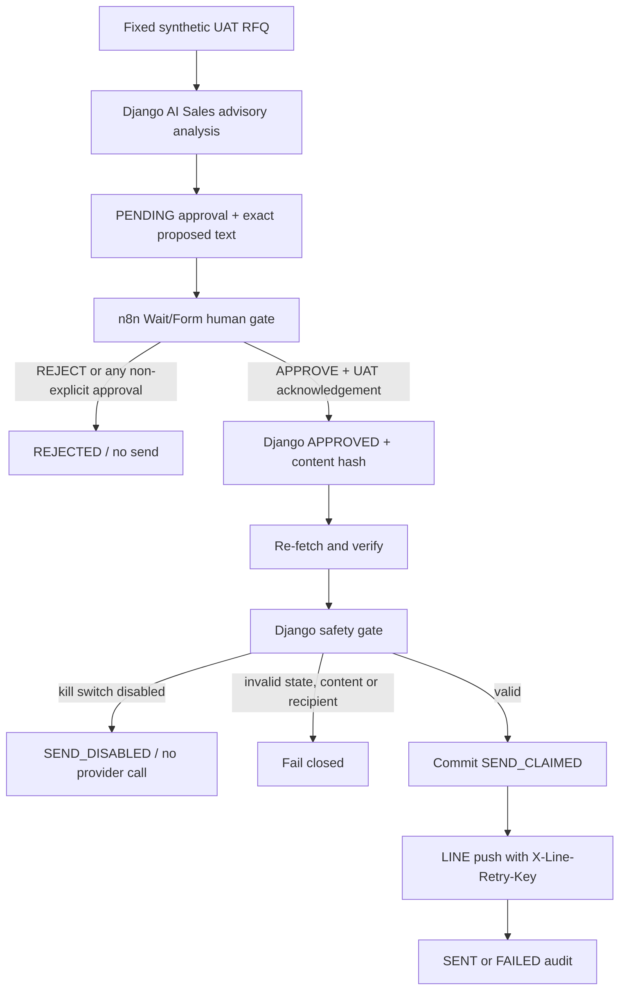

# N8N + DJANGO AI SALES + LINE UAT — SECURITY, SAFETY VÀ CODE REVIEW

**Review timestamp:** 2026-09-26 18:17:27 +09:00

**Repository:** `https://github.com/hoangquocquan/Django-web-t-123.git`

**Worktree:** `C:\Users\hoang\Documents\Codex\n8n-line-uat-demo`

**Branch:** `feature/n8n-line-uat-demo`

**Base commit:** `6c349268db269108f9a012656c5fef37a5b7ab85`

**Reviewed implementation commit:** `25d2f2a7a67a4fac2c76599913d6c52c7bfab350`

**Review method:** Static diff review, state-machine tracing, adversarial tests, migration checks, secret scan và isolated n8n import.

**Live LINE request:** Không thực hiện.

> **THIS WORKFLOW IS UAT ONLY. DO NOT CONNECT REAL CUSTOMER DATA. DO NOT ENABLE PRODUCTION SENDING.**

## 1. Kết luận điều hành

Implementation commit ban đầu có đúng hướng kiến trúc: n8n không gọi LINE trực tiếp; Django giữ safety boundary; human approval là bắt buộc; kill switch mặc định tắt; recipient lấy từ cấu hình allowlist; AI không có autonomous action.

Review phát hiện ba điểm hardening cần xử lý trước khi đánh dấu READY:

1. Exact message và recipient chưa được cryptographically bound tại thời điểm approve.
2. Provider call nằm trong database transaction, tạo failure window nếu LINE đã nhận nhưng process chết trước DB commit.
3. Send service dựa trên truthiness của setting thay vì chỉ chấp nhận literal boolean `True`.

Các điểm trên đã được sửa trên chính branch feature, kèm migration và adversarial tests. Sau hardening không còn finding `CRITICAL` hoặc `HIGH` unresolved.

**Kết luận:**

- **READY FOR SCENARIO A/B DRY-RUN**
- **READY FOR MANUAL LINE UAT CONFIGURATION**

Kết luận thứ hai chỉ xác nhận sẵn sàng cấu hình thủ công; không phải authorization để bật gửi hoặc gọi LINE thật.

## 2. Repository safety

Trước review đã xác nhận:

- Branch đúng: `feature/n8n-line-uat-demo`.
- Implementation commit `25d2f2a...` tồn tại trên branch.
- Base `origin/main` đúng commit `6c349268...`.
- Working tree sạch trước review.
- Không checkout hoặc merge `main`.
- Không push remote.
- Không reset, xóa hoặc overwrite thay đổi ngoài scope.
- Không thay đổi production credentials.
- Không bật `LINE_SEND_ENABLED=true` trong runtime.

## 3. Files reviewed

Review bao phủ toàn bộ implementation diff và các dependency bảo mật trực tiếp:

- `.env.example`
- `django_backend/.env.example`
- `django_backend/config/settings/base.py`
- `django_backend/apps/ai_agent/models.py`
- `django_backend/apps/ai_agent/migrations/0003_outboundmessageapproval.py`
- `django_backend/apps/foundation/migrations/0011_line_uat_permissions.py`
- `django_backend/apps/ai_agent/services/line_uat.py`
- `django_backend/apps/ai_agent/line_uat_views.py`
- `django_backend/apps/api/urls.py`
- `django_backend/apps/ai_agent/fixtures/line_uat_demo.json`
- `automation/n8n/line_uat_approval_demo.json`
- `automation/n8n/README.md`
- `docs/N8N_LINE_UAT_DEMO.md`
- `tests/test_line_uat_approval.py`
- Foundation bearer authentication và permission service.
- Observability/log formatter để xác minh request headers không bị log.

Hardening thêm:

- `django_backend/apps/ai_agent/migrations/0004_line_uat_send_hardening.py`

## 4. Architecture assessment



Django, không phải n8n, là source of truth cho status, environment, synthetic marker, channel, approved content, allowlist, kill switch và send claim.

## 5. Approval state-machine assessment

Đã xác minh các transition thực tế:

```text
NEW -> PENDING -> APPROVED -> SENT
                  |
                  +-> FAILED

PENDING -> REJECTED
```

`APPROVED` có thể giữ `line_result_status=SENDING` sau khi send claim đã commit nhưng provider outcome chưa được ghi nhận.

Kết quả review:

- Draft luôn được server tạo với `PENDING`.
- Client không được submit `status`, `recipient_ref`, `proposed_message`, `approved_by`, `provider_response` hoặc `sent_at`.
- Không có PATCH/PUT approval endpoint.
- `PENDING` và `REJECTED` không được send.
- Chỉ `PENDING` được approve hoặc reject.
- Không có `REJECTED -> APPROVED`, `APPROVED -> REJECTED` hoặc `SENT -> APPROVED`.
- `FAILED` không tự retry.
- `SENT` retry trả record hiện hữu và không gọi provider.
- Approve/send endpoints giờ yêu cầu empty payload, ngăn mass assignment.
- DB constraint giới hạn status vào tập đã định nghĩa.

Assessment: **PASS sau hardening**.

## 6. Backend safety boundary

Ngay trước send claim/provider call, Django xác minh:

- `status == APPROVED`
- `environment == "uat"`
- `synthetic is True`
- `channel == "line"`
- exact message/routing hash không đổi sau approval
- `LINE_SEND_ENABLED is True`
- configured recipient là string không rỗng
- `recipient_ref == LINE_UAT_RECIPIENT_USER_ID`
- LINE token là string không rỗng
- chưa tồn tại `send_claimed_at`

Các check này nằm trong Django service và không phụ thuộc vào n8n UI.

Assessment: **PASS**.

## 7. Authorization assessment

Permission matrix thực tế:

| Principal | Create/read | Approve | Reject | Send |
|---|---:|---:|---:|---:|
| Sales | Có | Không | Không | Không |
| Manager | Có | Có | Có | Có |
| Admin | Có | Có | Có | Có |
| Viewer/role khác | Không | Không | Không | Không |
| Anonymous | Không | Không | Không | Không |

Authorization dùng AND logic:

- Role phải thuộc allowlist tương ứng.
- User và role phải active qua `FoundationPermissionService`.
- Create/read cần `ai_sales:read`, `sales:read`, `line_uat:read`.
- Approve/reject/send cần thêm `line_uat:approve`.
- Bearer token phải hợp lệ, chưa hết hạn và chưa revoke.

Send endpoint không sử dụng permission yếu hơn approve.

Assessment: **PASS**.

## 8. Kill-switch assessment

`LINE_SEND_ENABLED`:

- Không có giá trị mặc định true.
- Env parser mới chỉ enable với explicit string `true` sau trim/casefold.
- Missing, empty, `false`, `False`, `FALSE`, `0`, `1`, `yes`, `on`, `None` và random string đều disabled.
- Service tiếp tục yêu cầu setting runtime phải là literal boolean `True`; string `"true"` bị fail closed nếu injected trực tiếp.
- Check diễn ra trước token read, send claim và provider call.

Khi disabled:

- `status` giữ `APPROVED`.
- `line_result_status=SEND_DISABLED`.
- `provider_response.mode=DRY_RUN`.
- `send_attempted=false`.
- Provider call count bằng 0.

Assessment: **PASS**.

## 9. Recipient allowlist assessment

- Recipient không đến từ request body hoặc n8n form.
- Draft lấy recipient từ `LINE_UAT_RECIPIENT_USER_ID`; khi chưa cấu hình chỉ lưu placeholder phục vụ dry-run.
- Live send yêu cầu configured recipient là string không rỗng.
- So sánh exact, case-sensitive sau trim cấu hình.
- `null`, empty, whitespace, list/array, wrong case, Unicode khác và destination khác đều fail closed.
- Recipient cùng exact message được đưa vào approval content hash.
- Thay đổi recipient sau approval bị chặn ngay cả khi allowlist runtime cũng bị đổi theo.
- Provider payload chỉ có một trường `to`; không có broadcast, multicast, narrowcast hoặc recipient list.

Assessment: **PASS**.

## 10. Approved-text integrity assessment

Tại approval, Django tạo SHA-256 fingerprint từ:

- channel
- environment
- exact proposed message
- recipient reference
- RFQ ID
- synthetic marker

Trước send, fingerprint được tính lại và so sánh constant-time. Nếu text hoặc routing thay đổi, service trả `approved_content_changed` và provider call count bằng 0.

n8n hiển thị `proposed_message` trong form và không có AI/generation node sau approval. Send service sử dụng chính `approval.proposed_message`; không regenerate hoặc mutate text.

Assessment: **PASS**.

## 11. Idempotency và concurrency assessment

Implementation commit ban đầu giữ external provider call bên trong `transaction.atomic()`. Cách này serialize concurrent requests nhưng vẫn có failure window:

```text
LINE accepts message
-> process crashes before DB commit
-> transaction rolls back to APPROVED
-> retry can send again
```

Hardening đã đổi sang at-most-once claim:

1. Lock approval row.
2. Validate toàn bộ safety boundary.
3. Atomically set `send_attempted=true`, `send_claimed_at`, `line_result_status=SENDING`.
4. Commit transaction.
5. Gọi LINE ngoài transaction với approval UUID trong `X-Line-Retry-Key`.
6. Ghi `SENT` hoặc `FAILED` trong transaction mới.

Concurrent request nhìn thấy committed claim và không gọi provider lần hai. Test sử dụng blocking provider và hai execution paths xác nhận provider call count bằng 1.

Theo tài liệu LINE, retry key ngăn cùng request được accepted lặp lại trong thời gian provider quản lý key là 24 giờ: [Retry failed API requests](https://developers.line.biz/en/docs/messaging-api/retrying-api-request/) và [Messaging API reference](https://developers.line.biz/en/reference/messaging-api/).

Không tuyên bố exactly-once hoặc guaranteed delivery. Nếu process chết sau claim, record đứng `SENDING` và phải human reconcile. Hệ thống không tự reset claim hoặc retry provider.

Assessment: **PASS cho UAT safety; MEDIUM operational limitation còn lại, không tạo automatic duplicate path**.

## 12. Provider failure assessment

Đã kiểm tra:

- Timeout/network/OSError: chuyển thành bounded `provider_failed`.
- HTTP 400/401/403/429/500: bounded error chỉ chứa status code.
- HTTP 409 với cùng retry key: coi là provider-deduplicated acceptance, lưu accepted request ID.
- Empty response: lưu `{}`.
- Invalid JSON: lưu marker `unparseable_response=true`, không crash.
- Success body đọc tối đa 4096 bytes.
- Không có retry loop hoặc automatic retry cho `FAILED`/`SENDING`.
- Raw provider error body không được lưu hoặc trả ra API.
- Token không được lưu trong provider response/audit.

Assessment: **PASS**.

## 13. Secret và logging assessment

Repository scan không tìm thấy credential thật trong scope review.

Các giá trị tìm thấy chỉ là:

- Empty env placeholders.
- n8n expressions tham chiếu environment variable.
- Synthetic test sentinel `super-secret-token`.
- Runtime construction của Authorization header trong provider adapter.

n8n export không chứa:

- LINE channel access token.
- LINE channel secret.
- LINE user ID thật.
- Django bearer token thật.
- n8n credential object.

Observability middleware chỉ log method, normalized route, status, correlation ID và duration. JSON formatter có safe-field allowlist; request headers/body không được log.

Operational caveat: n8n phải được cấu hình không cho người không có quyền xem execution data/config; bearer token vẫn là runtime secret của n8n process.

Assessment: **PASS**.

## 14. AI autonomous-action assessment

- Draft service luôn ép `human_approval_required=true`.
- Draft service luôn ép `autonomous_action=false`.
- n8n validation fail nếu `autonomous_action !== false`.
- Không có code mới mutate customer/CRM/quotation/order production.
- AI không approve, reject hoặc send.
- Exact message chỉ tiến tới provider sau Manager/Admin approval và backend gate.

Assessment: **PASS**.

## 15. n8n workflow và form assessment

Thứ tự đã xác minh:

```text
Manual Trigger
-> Set Synthetic RFQ
-> Create PENDING Draft
-> Validate Synthetic PENDING
-> Human Approval Gate
-> Explicit APPROVE + UAT Ack?
```

Reject branch:

```text
Persist REJECTED - No Send
-> STOP
```

Approve branch:

```text
Persist APPROVED
-> Re-fetch Approval
-> Verify APPROVED Safety State
-> Django Kill Switch + LINE Send
-> Final Audit Output
```

Chỉ exact string `APPROVE` với strict boolean acknowledgement `true`, kết hợp bằng `and`, mới đi approve branch. Missing, undefined, empty, unexpected string hoặc checkbox false đi reject/no-send.

Form hiển thị:

- RFQ ID.
- AI recommendation.
- Exact LINE message.
- UAT recipient marker.
- `UAT / SYNTHETIC — NO REAL CUSTOMER` warning.

Không có node gọi `api.line.me`, LINE node, access token hoặc content-regeneration node sau approval.

Workflow JSON được import thành công bằng n8n CLI `2.37.10` trong isolated temporary instance. Temporary instance đã được xóa sau validation.

Assessment: **PASS**.

## 16. Database constraint assessment

DB enforce:

- UUID primary key uniqueness.
- `environment = uat`.
- `synthetic = true`.
- `channel = line`.
- status chỉ thuộc `PENDING`, `APPROVED`, `REJECTED`, `SENT`, `FAILED`.
- `APPROVED`, `SENT`, `FAILED` phải có non-empty approved content hash.

Migration `0004` backfill hash cho record đã tồn tại trước khi thêm constraint, tránh migration failure khi database đã có UAT approval rows.

Assessment: **PASS**.

## 17. Input-validation assessment

Draft endpoint chỉ chấp nhận:

```json
{
  "rfq_id": "UAT-RFQ-001",
  "synthetic": true,
  "environment": "uat"
}
```

Đã test và chặn:

- `synthetic=false`
- `synthetic="true"`
- `synthetic=1`
- `environment=production`
- `environment=UAT`
- missing environment
- null RFQ
- unknown RFQ
- extra fields
- client-supplied recipient/status/message
- approve/send mass assignment

Assessment: **PASS**.

## 18. Findings table

| Severity | File/area | Finding | Impact trước fix | Fix/Disposition |
|---|---|---|---|---|
| HIGH | `services/line_uat.py` | External call nằm trong DB transaction; crash sau provider acceptance có thể rollback state và cho retry gửi lại | Có duplicate-send failure window | Commit claim trước call; block retry; gửi UUID qua `X-Line-Retry-Key` |
| HIGH | `services/line_uat.py`, model | Message/recipient không được fingerprint tại approval | Privileged/internal mutation có thể làm text được gửi khác text đã duyệt | SHA-256 approval content binding; DB constraint; adversarial mutation tests |
| MEDIUM | `services/line_uat.py`, settings | Service dùng truthiness cho kill switch | Alternate settings injection dạng non-empty string có thể được coi là enabled | Strict env parser và `is True` runtime check |
| MEDIUM | serializers/views | Boolean coercion và approve/send body chưa strict tuyệt đối | Contract ambiguity, tăng mass-assignment risk tương lai | JSON boolean-only field; required environment; empty payload serializers |
| MEDIUM | provider adapter | Không dùng retry key; invalid JSON có thể làm request path lỗi | Duplicate risk khi operator retry và weak response handling | `X-Line-Retry-Key`; 409 dedup handling; bounded invalid-JSON marker |
| MEDIUM | Operations | Crash sau committed claim có thể để record `SENDING` không có final outcome | Delivery outcome chưa xác định; cần operator reconcile | Unresolved by design: fail closed, no automatic retry; documented manual reconciliation |
| LOW | n8n operations | Django bearer token là runtime environment secret của n8n | Người có quyền cao trên n8n host có thể truy cập secret | Restrict n8n host/workflow/execution access; rotate short-lived token |

Không có secret exposure, approval bypass, recipient bypass hoặc production send path được xác nhận sau hardening.

## 19. Fixes performed

- Thêm exact approval content hash.
- Thêm DB constraints cho known status và approval hash.
- Thêm data migration backfill an toàn.
- Thêm committed send claim và `SENDING` audit state.
- Di chuyển provider call ra ngoài transaction đã commit claim.
- Thêm `X-Line-Retry-Key` dùng approval UUID.
- Xử lý LINE 409 như deduplicated accepted request.
- Strict kill-switch parsing và literal boolean runtime check.
- Strict JSON boolean cho `synthetic`.
- Bắt buộc explicit environment.
- Chặn extra fields/mass assignment trên approve/send.
- Bounded invalid JSON và HTTP/network failures.
- Thêm concurrency, crash-window, mutation, authorization, input, workflow topology và provider error tests.
- Cập nhật tài liệu để không tuyên bố exactly-once/guaranteed delivery.

**Fix commit:** `c429b585f2ce038010aefef6b36677665caa5c67` — `fix(line-uat): harden approval and send safety`.

## 20. Test results

Backend/security/regression suite:

```text
python -m pytest tests/test_line_uat_approval.py tests/test_ai_sales_mvp.py tests/test_sales_crm_ai.py -q
82 passed
```

Focused LINE UAT suite:

```text
53 passed
```

Additional validation:

```text
Ruff: All checks passed
Django makemigrations --check --dry-run: No changes detected
Django system check: 0 issues
JSON parse: passed
n8n CLI 2.37.10 isolated import: Successfully imported 1 workflow
git diff --check: passed
```

Không test nào gọi LINE thật.

## 21. Unresolved risks

### MEDIUM — Unknown provider outcome after process crash

Nếu process chết sau committed claim nhưng trước khi lưu response, approval giữ `status=APPROVED`, `line_result_status=SENDING`, `send_claimed_at` đã có. Đây là fail-closed state:

- Automatic retry không gọi provider.
- Human phải đối chiếu LINE/provider evidence và audit timestamp.
- Không được reset claim hoặc gửi lại tùy ý.
- LINE retry key có provider retention 24 giờ; sau thời gian đó cùng key có thể được xử lý như request mới.

Mitigation production phù hợp sau này là transactional outbox + durable worker + reconciliation workflow + explicit operator decision. UAT demo không tự động hóa reconciliation để tránh mở thêm send path.

### LOW — Runtime n8n bearer-token custody

n8n cần foundation Manager/Admin bearer token để gọi internal endpoints. Token không nằm trong export nhưng thuộc secret custody của n8n runtime. Cần short TTL, access restriction và rotation sau demo.

## 22. Live LINE UAT readiness

Scenario A — Reject:

- Provider call expected: `0`.
- Automated proof: PASS.

Scenario B — Approve với `LINE_SEND_ENABLED=false`:

- Provider call expected: `0`.
- `SEND_DISABLED`, `send_attempted=false`.
- Automated proof: PASS.

Scenario C — Live UAT:

- Không thực hiện trong review.
- Không có credential thật trong repository.
- Chỉ sẵn sàng cho operator cấu hình thủ công sau review.

## 23. Exact prerequisites trước Scenario C

Operator phải tự xác minh và cung cấp:

1. Dedicated LINE Messaging API UAT channel, không dùng production channel.
2. Operator's own UAT LINE account đã add bot.
3. `LINE_UAT_CHANNEL_ACCESS_TOKEN` từ UAT channel.
4. `LINE_UAT_RECIPIENT_USER_ID` đúng với tài khoản UAT của operator.
5. Manager/Admin foundation bearer token ngắn hạn cho n8n.
6. Django và n8n chạy trong isolated UAT environment.
7. Scenario A và B đã chạy lại thành công trên environment đó.
8. Exact form message đã được human đọc và approve.
9. Operator explicit đặt `LINE_SEND_ENABLED=true`, restart Django và xác minh setting.
10. Sau demo lập tức đặt lại `LINE_SEND_ENABLED=false`, restart Django và rotate/revoke token khi cần.

Không được dùng customer LINE ID, production CRM data, broadcast, multicast hoặc narrowcast.

## 24. Final readiness statement

**READY FOR SCENARIO A/B DRY-RUN**

**READY FOR MANUAL LINE UAT CONFIGURATION**

Không có authorization trong report này để bật live send. Scenario C vẫn yêu cầu operator cung cấp UAT-only credentials, explicit enable, human approval và giám sát thủ công.
